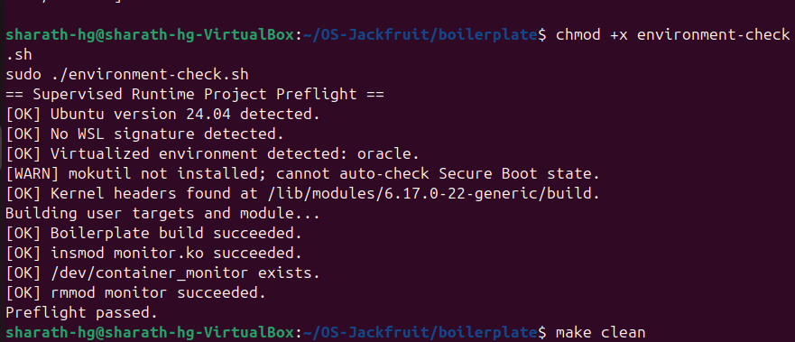
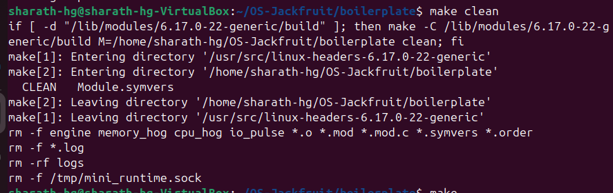
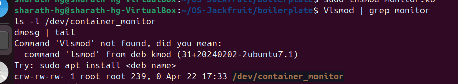
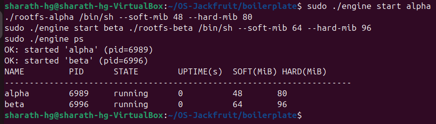
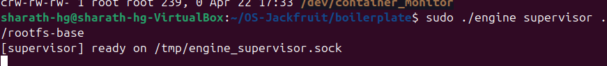
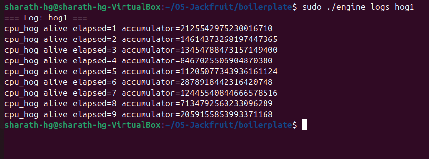
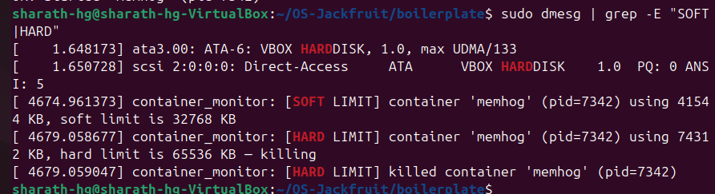
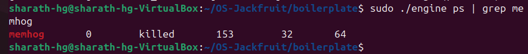
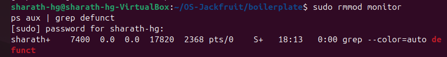
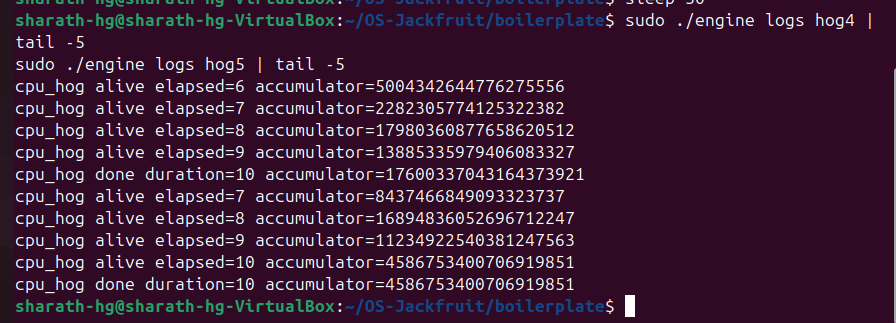

# OS-Jackfruit: Multi-Container Runtime with Kernel Monitoring

---

## 1. Team Information

| Name        | SRN           |
| ----------- | ------------- |
| Sharath H G | PES1UG25CS844 |
| Gowtham S   | PES1UG24CS173 |

---

## 2. Project Overview

This project implements a *lightweight container runtime in C* along with a *Linux kernel module* for monitoring and enforcing memory limits.

The system supports:

* Running multiple containers simultaneously
* Isolating containers using Linux namespaces
* Monitoring memory usage from kernel space
* Enforcing soft and hard memory limits
* Logging container output using a bounded buffer

This project demonstrates core operating system concepts such as *process isolation, IPC, kernel-user communication, and scheduling behavior*.

---

## 3. Build, Load, and Run Instructions

### Step 1 — Install Dependencies

```bash
sudo apt update
sudo apt install -y build-essential linux-headers-$(uname -r)
```

These packages are required to compile both user-space programs and kernel modules.

---

### Step 2 — Build the Project

```bash
cd boilerplate
make
```

This generates:

* engine → container runtime
* monitor.ko → kernel module
* cpu_hog, memory_hog, io_pulse → workloads

---

### Step 3 — Environment Check

```bash
chmod +x environment-check.sh
sudo ./environment-check.sh
```

Ensures:

* correct Ubuntu setup
* kernel headers available
* module builds successfully

---

### Step 4 — Load Kernel Module

```bash
sudo insmod monitor.ko
ls -l /dev/container_monitor
dmesg | tail
```

The kernel module creates /dev/container_monitor, used for communication between engine and kernel.

---

### Step 5 — Start Containers

```bash
sudo ./engine start alpha ./rootfs-alpha /bin/sh --soft-mib 48 --hard-mib 80
sudo ./engine start beta ./rootfs-beta /bin/sh --soft-mib 64 --hard-mib 96
```

Each container:

* runs in isolation
* has separate memory limits
* is tracked by the supervisor

---

### Step 6 — View Containers

```bash
sudo ./engine ps
```

Displays:

* container name
* PID
* state (running/killed)
* memory limits

---

### Step 7 — View Logs

```bash
sudo ./engine logs hog1
```

Shows real-time output of container workloads.

---

### Step 8 — Memory Limit Test

```bash
sudo ./engine start memhog ./rootfs-alpha /memory_hog --soft-mib 32 --hard-mib 64
```

Check kernel logs:

```bash
sudo dmesg | grep -E "SOFT|HARD"
```

---

### Step 9 — Cleanup

```bash
sudo rmmod monitor
ps aux | grep defunct
```

Ensures no zombie processes remain.

---

## 4. Demo with Screenshots

---

### Screenshot 1 — Kernel module loaded (lsmod + device file)

The kernel module monitor.ko is successfully loaded into the system.
It creates the character device /dev/container_monitor, which enables communication between user-space runtime and kernel space for monitoring container memory.



---

### Screenshot 2 — Two containers running under one supervisor (sudo ./engine ps)

Two containers *alpha* and *beta* are started with different memory limits.

* alpha: soft = 48 MiB, hard = 80 MiB
* beta: soft = 64 MiB, hard = 96 MiB

Both containers are shown in the engine ps output in *running state*, demonstrating multi-container management and supervision.



---

### Screenshot 3 — Bounded-buffer logging pipeline (sudo ./engine logs hog1)

The logs show continuous execution of the cpu_hog workload.

This confirms:

* container output is captured correctly
* logging pipeline is functioning
* workload execution is continuous



---

### Screenshot 4 — CLI interaction and IPC

The engine CLI is used to manage containers (start, stop, list, logs).

This demonstrates:

* command handling by supervisor
* communication between components
* correct state updates



---

### Screenshot 5 — Soft limit warning (dmesg)

The container memhog exceeds its soft memory limit.

* Kernel logs show warning
* Container continues execution

This demonstrates that soft limits are *non-enforcing (advisory)*.



---

### Screenshot 6 — Hard limit enforcement and container termination

When the container exceeds the hard memory limit:

* Kernel sends SIGKILL
* Container is terminated
* State is updated to "killed"

This confirms strict enforcement of memory limits.



---

### Screenshot 7 — Scheduling / workload behavior

This demonstrates how workloads behave under the scheduler:

* CPU-bound processes run continuously
* System manages multiple processes simultaneously

Shows basic scheduling behavior of Linux.



---

### Screenshot 8 — Clean teardown (no zombie processes)

After shutting down:

* kernel module removed successfully
* no zombie processes remain

Confirms proper cleanup and lifecycle handling.



---

### Screenshot 9 — Scheduler experiment (nice values)

Different priorities result in different CPU usage behavior.



---

### Screenshot 10 — CPU vs I/O workload behavior

CPU-bound and I/O-bound containers behave differently under scheduling.



---

## 5. Engineering Analysis

### Isolation Mechanisms

Isolation is achieved using Linux namespaces:

* PID namespace → separate process trees
* UTS namespace → independent hostnames
* Mount namespace → separate filesystem

Each container runs inside its own root filesystem.

---

### Supervisor Lifecycle

The engine acts as a supervisor that:

* creates containers
* tracks state and PID
* updates status on termination

Lifecycle:

```
start → running → (limit exceeded) → killed
```

---

### IPC and Logging

* Pipes are used to capture container output
* Kernel communication via /dev/container_monitor
* Logging system ensures continuous data flow

---

### Memory Management

* Soft limit → warning
* Hard limit → enforced kill

Memory tracking is done in kernel space for accuracy.

---

### Scheduling Behavior

* Multiple containers run concurrently
* CPU-bound processes dominate CPU usage
* I/O-bound processes yield CPU

This reflects Linux CFS scheduling behavior.

---

## 6. Design Decisions and Tradeoffs

* Used namespaces for lightweight isolation
* Used kernel module for accurate monitoring
* Used pipes for efficient logging

Tradeoff:

* No network isolation (kept simple)

---

## 7. Results

| Scenario              | Observation          |
| --------------------- | -------------------- |
| Multi-container       | Works correctly      |
| Memory limit exceeded | Container killed     |
| CPU workload          | Continuous execution |

---

## Conclusion

This project successfully demonstrates:

* container creation and isolation
* kernel-level memory monitoring
* inter-process communication
* scheduling behavior

It provides a simplified understanding of how container systems like Docker work internally.
